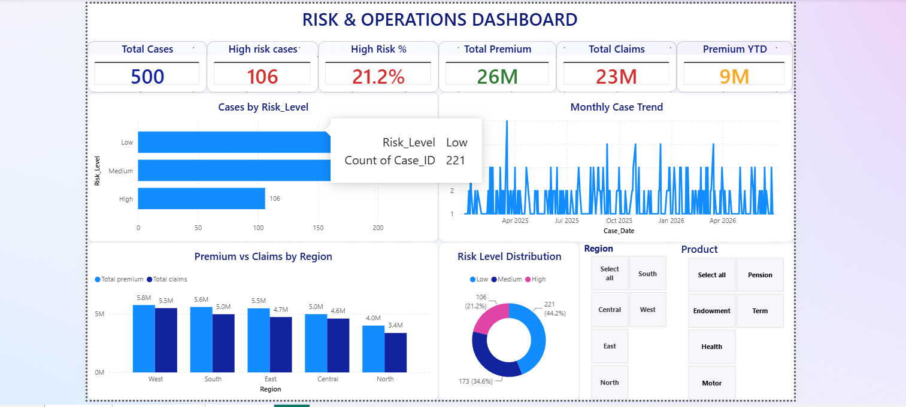

# 📊 Risk Operations Analytics

## 📌 Project Overview

This project demonstrates an end-to-end Risk Operations Analytics solution using SQL Server, Power BI, and Microsoft Excel.

The project analyzes operational case data to generate business insights related to premium collection, claims, regional performance, compliance, SLA performance, and risk distribution.

---

# 🎯 Business Problem

Insurance companies process thousands of operational cases every day. Management requires timely insights to monitor:

- Premium Collection
- Claims Performance
- Risk Distribution
- Regional Performance
- Compliance Status
- SLA Performance
- Product Performance

This project answers these business questions using SQL Server and visualizes the results in Power BI.

---

# 🛠️ Tools Used

- SQL Server
- SQL Server Management Studio (SSMS)
- Microsoft Power BI
- Microsoft Excel
- Power Query
- DAX

---

# 📚 SQL Concepts Covered

### Basic SQL

- SELECT
- WHERE
- ORDER BY
- TOP

### Aggregate Functions

- COUNT()
- SUM()
- AVG()

### Intermediate SQL

- GROUP BY
- HAVING
- CASE WHEN

### Advanced SQL

- Subqueries
- Common Table Expressions (CTEs)
- Views
- ROW_NUMBER()
- RANK()
- DENSE_RANK()

---

# 📈 Power BI Features

- Data Cleaning
- Power Query
- Data Modeling
- Relationships
- DAX Measures
- KPI Cards
- Interactive Charts
- Slicers
- Dashboard Design

---

# 📊 Business Questions Solved

- Total Operational Cases
- Total Premium Collected
- Total Claims Paid
- Premium by Region
- Claims by Region
- Premium vs Claims Analysis
- Risk Level Distribution
- Case Status Analysis
- Product Performance
- High Risk Cases
- Compliance Analysis
- SLA Performance
- Claim Ratio by Region
- Monthly Premium Trend
- Executive KPI Summary

---

# 📂 Project Structure

```
Risk-Operations-Analytics/
│
├── README.md
├── Risk_Operations.sql
├── Risk_Operations_Dashboard.pbix
├── Power_BI_Risk_Operations_Practice.xlsx
├── Business_Insights.md
└── Screenshots/
```

---

# 📷 Dashboard Preview



---

# 💡 Key Business Insights

- Identified the highest premium-generating region.
- Compared premium collection against claims paid.
- Calculated regional claim ratios.
- Monitored SLA compliance.
- Classified operational cases by risk level.
- Ranked products based on premium generated.

---

# 🚀 Future Improvements

- Connect Power BI directly to SQL Server
- Publish dashboard to Power BI Service
- Enable Scheduled Refresh
- Implement Row-Level Security (RLS)

---

# 👨‍💻 Author

**Vijay**

Aspiring Business Analyst

Skills:
- SQL
- Power BI
- Excel
- Data Analysis

---

# ⭐ If you found this project useful, consider giving it a Star.
